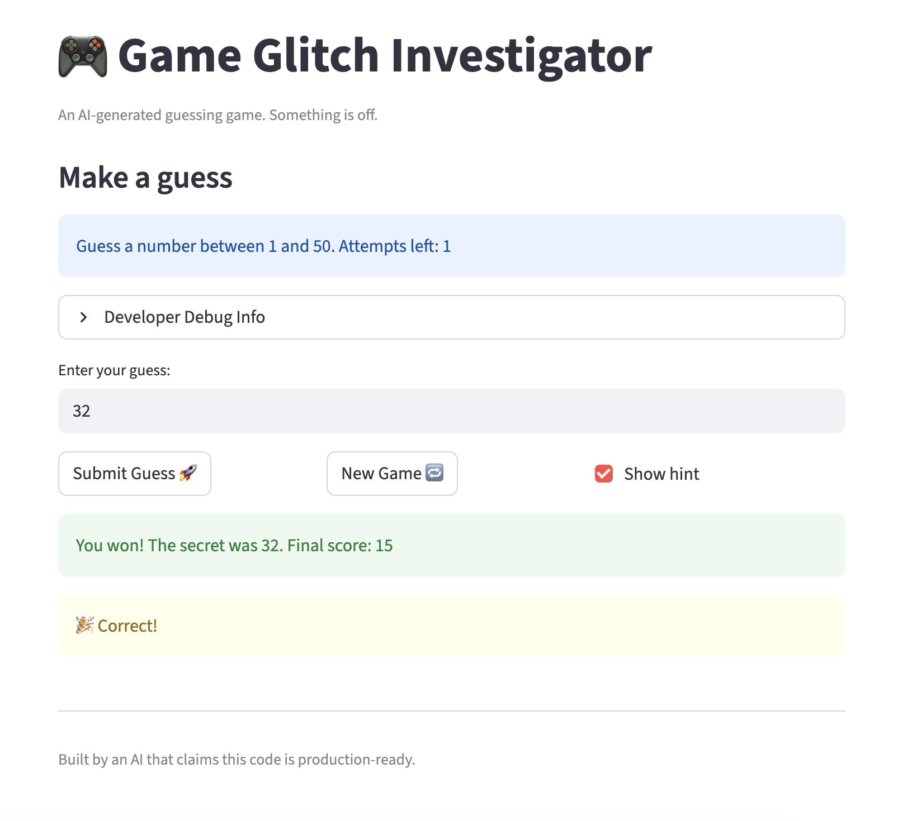

# 🎮 Game Glitch Investigator: The Impossible Guesser

## 🚨 The Situation

You asked an AI to build a simple "Number Guessing Game" using Streamlit.
It wrote the code, ran away, and now the game is unplayable. 

- You can't win.
- The hints lie to you.
- The secret number seems to have commitment issues.

## 🛠️ Setup

1. Install dependencies: `pip install -r requirements.txt`
2. Run the broken app: `python -m streamlit run app.py`

## 🕵️‍♂️ Your Mission

1. **Play the game.** Open the "Developer Debug Info" tab in the app to see the secret number. Try to win.
2. **Find the State Bug.** Why does the secret number change every time you click "Submit"? Ask ChatGPT: *"How do I keep a variable from resetting in Streamlit when I click a button?"*
3. **Fix the Logic.** The hints ("Higher/Lower") are wrong. Fix them.
4. **Refactor & Test.** - Move the logic into `logic_utils.py`.
   - Run `pytest` in your terminal.
   - Keep fixing until all tests pass!

## 📝 Document Your Experience

- [ ] The game's purpose is to have a user guess the secret number within a limited number of attempts.
- [ ] Bugs:
   1. Hints were backwards
   2. New game button did not create a new game to start over (did not do anything)
   3. Normal level had a higher range than Hard level which meant Normal was more difficult than Hard
   4. Easy mode range is 1-20 but the secret number was 44 which was out of range
   5. Message at top always says "Guess a number between 1 and 100" regardless of level chosen
   6. Game ended even with 1 attempt remaining
   7. First guess is not counted as attempt 1
   8. Attempts only count every other attempt
   9. Guessing a number that is "Too High" every other time rewards points instead of deducting
- [ ] Fixes:
   1. Swapped hint messages
   2. Initialized all states back to empty or 0
   3. Changed the range
   4. Fixed with range change
   5. Used variables to reflect bounds rather than hardcoding
   6. Initialized attempt variable to 0 instead of 1
   7. Initialized attempt to 0
   8. Always took secret number as integer instead a string like it did on every even attempt previously
   9. Deducted points instead of adding

## 📸 Demo

- 
